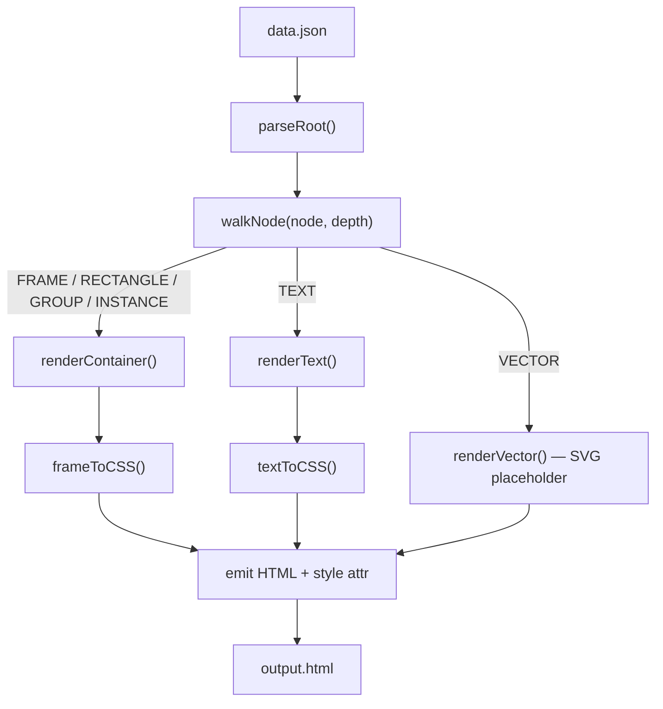

# Figma JSON → HTML/CSS Parser Plan

## What the file contains (key facts)

- **605 nodes**, max depth **12**, single root `FRAME`
- Node types: `FRAME` (182), `INSTANCE` (217), `TEXT` (129), `VECTOR` (73), `RECTANGLE` (2), `GROUP` (2)
- Layout: heavy **auto-layout** (`layoutMode: HORIZONTAL/VERTICAL`) → maps cleanly to **Flexbox**
- Sizing: `HUG` → `fit-content`, `FIXED` → explicit `px`, `FILL` → `flex: 1`
- Fills: mostly `SOLID`, one `GRADIENT_LINEAR`; **no IMAGE fills**
- Effects: 25 `INNER_SHADOW`, 1 `DROP_SHADOW` → `box-shadow`
- Colors reference **`VARIABLE_ALIAS`** tokens — raw `color` fallbacks are available in every fill object alongside the alias
- `VECTOR` nodes have no paintable children — must export as SVG separately

---

## Architecture



---

## Files to create

- **`parser/index.ts`** — entry point, reads `data.json`, kicks off `walkNode`, writes `output.html`
- **`parser/nodeToHtml.ts`** — recursive `walkNode`, dispatches per type
- **`parser/cssBuilder.ts`** — pure functions: `frameToCSS`, `textToCSS`, `paintToCSS`, `effectToCSS`
- **`parser/types.ts`** — TypeScript interfaces for Figma node/paint/effect shapes
- **`parser/tsconfig.json`** and **`package.json`** for the parser sub-project

---

## Key mapping rules per node type

### FRAME / RECTANGLE / INSTANCE (container)

```
layoutMode === "HORIZONTAL"  →  display:flex; flex-direction:row
layoutMode === "VERTICAL"    →  display:flex; flex-direction:column
(none)                       →  display:block; position:relative  (or absolute if layoutPositioning=ABSOLUTE)

primaryAxisAlignItems  →  justify-content (CENTER, FLEX_START, FLEX_END, SPACE_BETWEEN)
counterAxisAlignItems  →  align-items

paddingLeft/Right/Top/Bottom  →  padding
itemSpacing                   →  gap
layoutSizingHorizontal=HUG    →  width:fit-content
layoutSizingHorizontal=FIXED  →  width: <absoluteBoundingBox.width>px
layoutSizingHorizontal=FILL   →  flex:1; min-width:0
(same for Vertical / height)

rectangleCornerRadii[TL,TR,BR,BL]  →  border-radius: {tl}px {tr}px {br}px {bl}px
cornerRadius (single)              →  border-radius: Xpx

fills[0] type=SOLID         →  background: rgba(r*255, g*255, b*255, a)
fills[0] type=GRADIENT_LINEAR  →  background: linear-gradient(...)
strokes                     →  border: <weight>px solid <color>
strokeAlign=INSIDE          →  box-sizing:border-box; outline/inset shadow instead
clipsContent=true           →  overflow:hidden
```

### TEXT

```
characters          →  text content
style.fontFamily    →  font-family
style.fontWeight    →  font-weight
style.fontSize      →  font-size (px)
style.lineHeightPx  →  line-height (px)
style.letterSpacing →  letter-spacing (px, convert em if needed)
style.textAlignHorizontal  →  text-align
fills[0] SOLID      →  color
```

### VECTOR

Vectors have no rasterizable children in this JSON. Render as:

```html
<div class="figma-vector" style="width:Xpx;height:Ypx;background:#eee" title="<name>" />
```

and note in comments that real rendering needs the Figma Images API (`/images` endpoint with `format=svg`).

### Effects → box-shadow

```
DROP_SHADOW   →  box-shadow: <offsetX>px <offsetY>px <radius>px <spread>px rgba(...)
INNER_SHADOW  →  box-shadow: inset <offsetX>px <offsetY>px <radius>px rgba(...)
```

---

## What you can improve in the data for better parsing

### 1. Resolve design tokens (most impactful)

Every color in the file has a `VARIABLE_ALIAS` reference alongside the raw hex:

```json
"fills": [{ "color": { "r": 1, "g": 1, "b": 1, "a": 1 },
            "boundVariables": { "color": { "id": "VariableID:..." } } }]
```

Call the **Figma Variables API** (`GET /v1/files/:key/variables/local`) and build an `id → CSS variable name` map so fills emit `var(--color-bg-primary)` instead of raw `rgba(255,255,255,1)`.
Use the Figma MCP server instead — it handles its own OAuth and can read variables without you needing to deal with scopes directly. The MCP server is already connected in your workspace.

### 2. Export VECTORs as SVGs

73 of 605 nodes are `VECTOR`. Use the **Figma Images API**:

```
GET /v1/images/:fileKey?ids=<comma-separated-node-ids>&format=svg
```

Download each SVG and inline or reference it via ``.

### 3. Include the full Variables API response in the export

Currently `data.json` is only the `/nodes` endpoint response. Enrich the export by also fetching:

- `GET /v1/files/:fileKey/variables/local` → token IDs → CSS custom properties
- `GET /v1/files/:fileKey/styles` → shared text/fill styles

### 4. Resolve INSTANCE overrides

`INSTANCE` nodes carry an `overrides` array listing which fields are overridden from the component default. The current file already resolves children inline (the resolved tree is present), so this is mostly handled — but `overriddenFields` metadata can be used to know which CSS properties came from the instance vs. the base component.

### 5. Use `absoluteRenderBounds` for text sizing

`absoluteBoundingBox` on `TEXT` nodes includes empty descender space. `absoluteRenderBounds` is the visual ink bounds — more accurate for `width`/`height` on `textAutoResize` nodes.

### 6. Handle `layoutPositioning: "ABSOLUTE"` correctly

One node in the tree uses `"ABSOLUTE"` positioning. The parser must detect this and emit `position:absolute` with `left`/`top` computed relative to the parent's bounding box, not just `absoluteBoundingBox` (which uses canvas coordinates).

---

## Setup

```bash
cd parser
npm init -y
npm install typescript ts-node @types/node
npx ts-node index.ts
```

Output: `output.html` — one self-contained file with all styles inlined as `style="..."` attributes.

---

## Session 2 — Polaris React page (completed)

### Design analysis (from `Frame 316125014.png` + `data.json`)

The Figma frame is a **Shopify admin list page** with four distinct zones:

| Zone | Description | Polaris component chosen |
|---|---|---|
| Top bar — left | "Workflows \| Functions" segmented switcher (Functions active) | `ButtonGroup variant="segmented"` with `pressed` state |
| Top bar — right | "Create new ▾" dark filled button with chevron | `Button disclosure` |
| Filter row | "All \| On \| Off" tabs + search / filter / sort icons | `IndexFilters` with `tabs` prop + `useSetIndexFiltersMode` |
| Table | Checkbox, Name, Status (badge), Created at | `IndexTable` inside `LegacyCard` |
| Status badges | "Draft" (orange) and "Published" (green) | `Badge tone="attention"` / `Badge tone="success"` |
| Pagination | Right-aligned `< 1-10 of 12 >` | `Pagination` with `label` prop inside `InlineStack align="end"` |

### Key Polaris component decisions

- **`ButtonGroup variant="segmented"`** — renders the pill/outline segmented control from the design. The `pressed` boolean prop on each child `Button` handles the active state styling without custom CSS.
- **`IndexFilters`** — a single composite component that replaces manual tab + search + filter + sort icon wiring. In its default (`IndexFiltersMode.Default`) state it shows the tabs row and the three action icons, which exactly matches the design's filter row.
- **`LegacyCard` + `IndexTable`** — follows the same pattern shown in the Polaris IndexTable documentation examples. `IndexFilters` sits above `IndexTable` inside the same card; they share no explicit coupling but Polaris styles them as a unit.
- **Variables API limitation** — `design/variables.json` returned an empty `styles` array and the note `"Only enterprise plan can use this API"`. Color tokens could **not** be resolved to CSS variable names. The raw `rgba` fallbacks inside every `fills[0].color` object in `data.json` were used directly instead (and for the Polaris page, Polaris design tokens handle colors automatically via the `tone` prop).

### Output file

`WorkflowsPage.tsx` — drop this file into any React app that has `@shopify/polaris` installed.  
Required Polaris imports:

```ts
import {
  Page, LegacyCard, IndexTable, IndexFilters,
  useSetIndexFiltersMode, useIndexResourceState,
  Text, Badge, Button, ButtonGroup,
  InlineStack, BlockStack, Pagination,
} from '@shopify/polaris';
```

### Remaining gaps / future improvements

1. **Real data** — `ITEMS` array is hardcoded from the two design rows. Wire to an API or props.
2. **`Create new` popover** — the disclosure button needs a `Popover` with an `ActionList` for the dropdown options.
3. **Tab filtering logic** — "All / On / Off" tabs currently only update `selectedFilterTab` state; no actual filtering is applied to the rows.
4. **Top-tab content swap** — switching between "Workflows" and "Functions" renders the same table; a real implementation would fetch/filter different data sets.
5. **Variables API (enterprise)** — if the Figma plan is upgraded, fetch `GET /v1/files/:fileKey/variables/local` and map `VariableID` → Polaris token name for fully token-aware color output in the HTML parser track.
